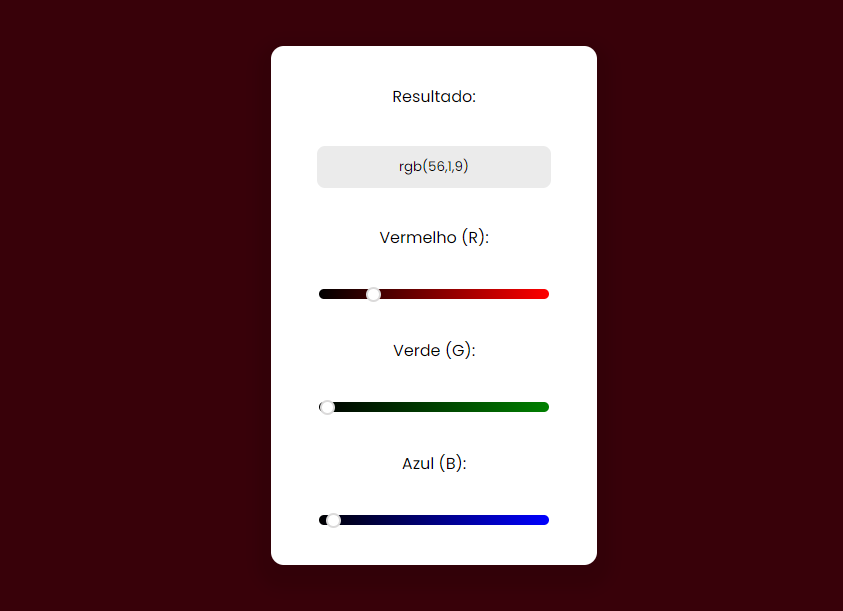

# rgb-generator-web

Código feito na Tríade Web (HTML, CSS e JavaScript), em que o Usuário pode manipular valores de cores RGB, até escolher a cor que deseja utilizar.

Este código foi feito em 2022, em um estudo da programação web.
